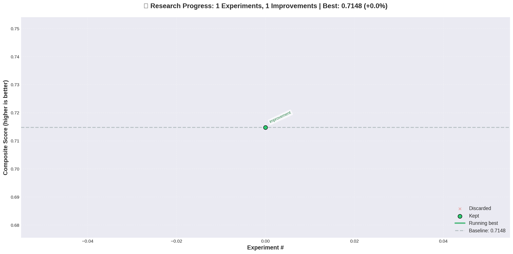

# Portfolio Rebalancing Research

Autonomous genetic algorithm research for portfolio optimization.

## Latest Results

**Best Score:** 0.714781
**Improvement:** +0.151378 (+26.868511527272666%)
**Server:** 18.222.124.145
**Branch:** autoresearch/machine1_20260529_023245
**Updated:** 2026-05-29 03:24:32 UTC

### Metrics
- **Sharpe Ratio:** 1.4257
- **CAGR:** 0.1337
- **Max Drawdown:** -0.1534
- **Volatility:** 0.0909

## Research Progress

---
*Last updated by 18.222.124.145 on 2026-05-29 03:24:32 UTC*
